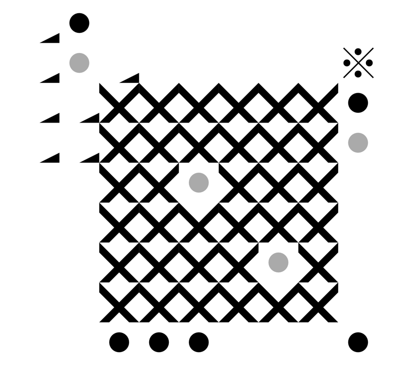

##  Care Fiction

"Commoning" is an umbrella term that brings together all the different ways people achieve to share the access and care of material and immaterial resources that in our society are more likely to be distributed top-down. Anything can be a Commons. A oven in a small village, an open source archive, a vegetables garden.
We started fiction 0, "The White House", and we'd like to imagine with us how a scenario of commoning could look like. We put a few rudimental tools in place for you to co-write the story, to dream, envision, conceive, project. The more we all add, the more the story becomes richer, and selected. May the dream breach through the screen and become real.
We are three students from Design Academy Eindhoven who are interested in the topic of commoning.

#### Care Fiction is decentralized.

By being here, you become one node of the mesh. The fiction you see, write or act on is distributed among all the nodes, which means, all current visitors share between them the content of the site.

The text you read, the image you upload, the sketch you draw, the vote you make, all this is shared and synchronized between all of us.

#### It's peer-to-peer, like torrents.

To ensure availability of the content, even when you are the only visitor, there is a special visitor, a 24h connected visitor, who is in reality a computer living in a datacenter.

There is no central authority. The responsability is shared.

The page you see here, is one application built on top of this distributed network of Care Fiction(s).

Hosted in a server the application only serve an empty "index.html" page that hold the algorithm to connect us all and fill it with the distributed content and let you add to the chain of content.

Yet, any developer is able to innovate by creating new applications, new websites, all while reusing existing data that was created here, by us.

To make it possible, we are reusing the efforts of the open source community, including Prof. Tim Berners-Lee work, inventor of the World Wide Web who advocates for a redesign of the web authority and for true data ownership (see the Solid Project). In our case, this project is built apon the Gun framework to whom we are grateful.

- The Code: https://github.com/nestarz/carefiction
- The Solid Project: https://solid.mit.edu/
- The Gun Framework: https://gun.eco/
